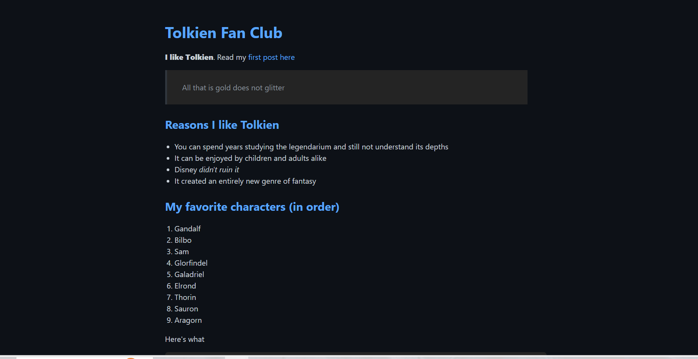
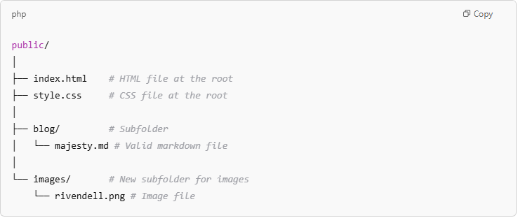

# Static Site Generator

I'm excited to showcase a static site generator I built using Python. This tool lets users upload markdown, CSS, and image files, which are then processed and converted into fully styled HTML pages.

## Visit The Site

Feel free to check out the [project here](https://barronbytes.github.io/Static-Site-Generator/)!

<!-- HTML image tag to control size -->

## Features

**Python Backend:** Used type hinting and `unittest` for 58 edge cases, all of which passed.

## Prerequisites

Before running this project locally, ensure you have the following installed:

* IDE (VS Code, PyCharm, etc.)
* Python 3.9 or higher > *for version of type hinting syntax used*
* Bourne Shell compatible OS like Linux or macOS > *Windows users should [download WSL2](https://learn.microsoft.com/en-us/windows/wsl/install)*

## Quick Start

Follow the steps below to correctly setup the project on your local device.

### Backend Setup

1. Clone the repository
2. Locate **content folder** > delete the default files and subfolders
3. Locate **demo folder** > delete folder *(it's not needed for functionality)* 
4. Locate **static folder** > delete the default files and subfolders
5. Locate **README.md file** > edit file contents to your liking

## Usage

Follow three steps to run the program for your custom needs:

### Step 1: Upload Markdown Files

* **File Types:** Only files with the **.md** extension can be saved in the **content folder** and its subfolders.
* **Root Folder:** One file called **index.md** is required. Additional files and subfolders are allowed.

**Example Content Folder Structure:**

### Step 2: Upload Assets Files

* **Styling:** The **static folder** must have one **index.css** file for styling of web pages.
* **Optional:** You can add additional subfolders to save images.

**Example Static Folder Structure:**

### Step 3: Run Program

* Open terminal.
* The absolute path in the terminal should match the root project folder name, Static-Site-Generator.
* Type the command `bash main.sh` to run the program.

Running the program does two things: it clears the **public folder** and then populates it with the necessary contents. Your original **.md** files have now been converted to **.html** files, styled properly, and linked to the uploaded assets. **DO NOT** edit any files in the root folder or src subfolder unless you want to customize the code at the heart of this project's functionality. The image below shows how the sample files from the previous two steps would be processed and saved.

**Example Public Folder Structure:**

## Development Roadmap

### Setbacks

As the project grew, it became challenging to track data types for method parameters and return values since Python is not statically typed by default. Initially, I relied on comments to manage this, but later [discovered Python’s type hinting feature](https://docs.python.org/3/library/typing.html). This significantly boosted my productivity, making it easier to implement code enhancements and write unit tests for edge cases. Lastly, this project taught me a valuable lesson: **ALWAYS** push your changes to GitHub. After nearly completing the project, a failed Windows update blocked access to my files, forcing me to wipe my device clean and start over.

### Successes

**Regular Expressions:** *inline_markdown.py, block_markdown.py, create_page.py*

* **Data cleaning and preparation:** Utilized enums to match patterns in markdown files and convert them into HTML components.
* **Reading and writing files:** Generated HTML files by reading a template and updating its content based on pattern matches of HTML components.
* **Python `re` library methods used:** compile(), search(), findall(), finditer(), split()

**File Management:** *copy_directory.py*

* **Recursion:** Used to copy files and nested directories from one folder to another, maintaining the original structure.
* **Python `os` and `shutil` library methods used:** abspath(), dirname(), join(), exists(), isdir(), isfile(), listdir(), mkdir(), rmtree(), walk()

**Unit Testing:**

* **Code coverage with `unittest` library**: 58 tests written and passed for edge cases in 9 Python files.
* **Common test environment:** Simplified test writing by using setUp() method.

### Improvements

The current project setup requires users to manually download and run it locally in an IDE, which limits the potential user base. Many users may not be familiar with this process, making it difficult for a broader audience to use the tool.

The next step for improvement is to develop a frontend component. A web app would allow users to easily upload files and download their results with a simple click. Additionally, the app could temporarily cache uploaded files to streamline the process.

## Credits & Contributing

Thank you [boot.dev](boot.dev) for providing an online back-end learning platform with integrated project ideas. Contributions are welcome! Feel free to submit a pull request to improve the project or open an issue to report any problems.
