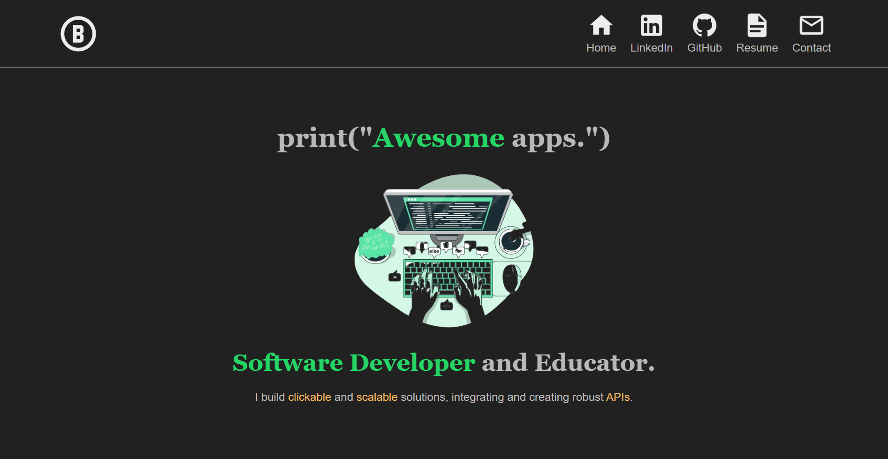

# Cloud Resume Challenge [🏡](https://github.com/barronbytes/mini-projects/tree/main)

I created my portfolio website alongside completing the [Cloud Resume Challenge](https://cloudresumechallenge.dev/docs/the-challenge/aws/), gaining hands-on experience with software development and cloud services.

## Visit The Site [🔝](#cloud-resume-challenge-)

Feel free to check out the [project here](README.md)! *Link currently down.*

## Tech Stack [🔝](#cloud-resume-challenge-)

- **Frontend:** HTML, CSS, CSS Grid, Flexbox
- **Backend:** *in progress*
- **Cloud:** AWS, Cloudflare

## Prerequisites [🔝](#cloud-resume-challenge-)

The following services were used to complete this project:

- [AWS account](https://aws.amazon.com/)
- [Cloudflare account](https://www.cloudflare.com/)

## The Cloud Resume Challenge – AWS Steps [🔝](#cloud-resume-challenge-)

This project includes 16 steps, with the completed ones highlighted in bold.

1. **Certification:** Obtained AWS Cloud Practitioner Certification.
2. **HTML:** Wrote accessible HTML for screen readers.
3. **CSS:** Achieved responsive design with custom variables, CSS Grid, and Flexbox.
4. **Static Website:** Utilized **AWS S3** bucket for file storage and static website hosting.
5. **HTTPS:** Purchased domain name with **Cloudflare** instead of AWS.
6. **DNS:** Via Cloudflare.
7. Javascript
8. Database
9. API
10. Python
11. Tests
12. Infrastructure as Code (IaC)
13. Source Control
14. CI/CD (Backend)
15. CI/CD (Frontend)
16. Blog Post
