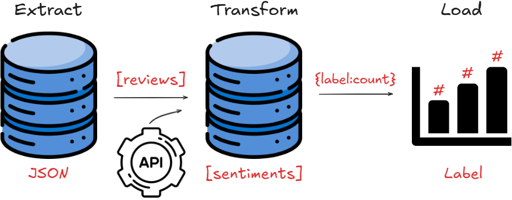
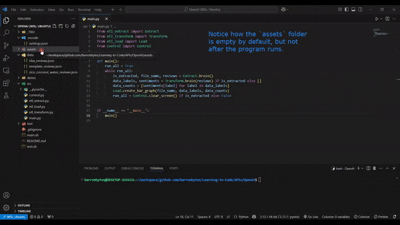
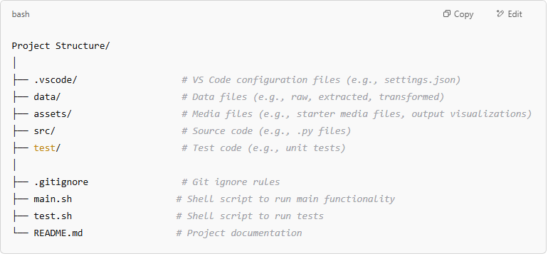
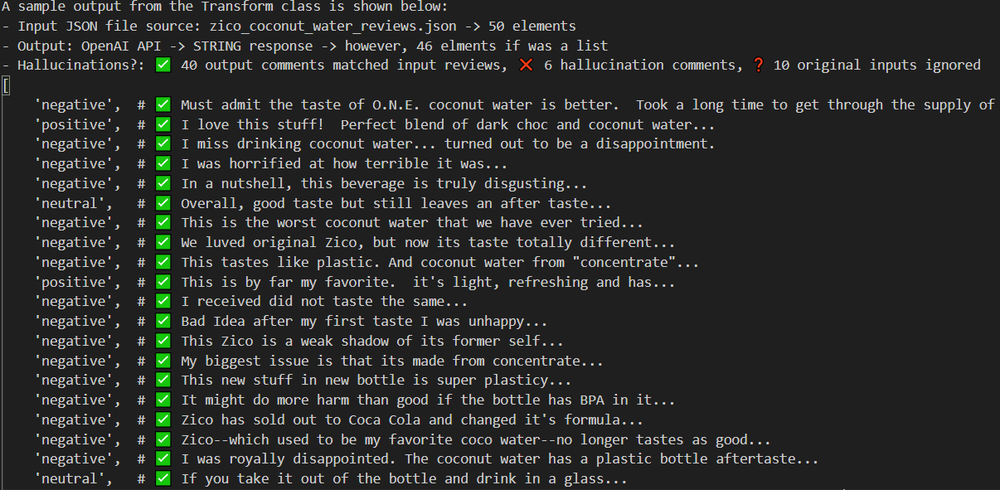
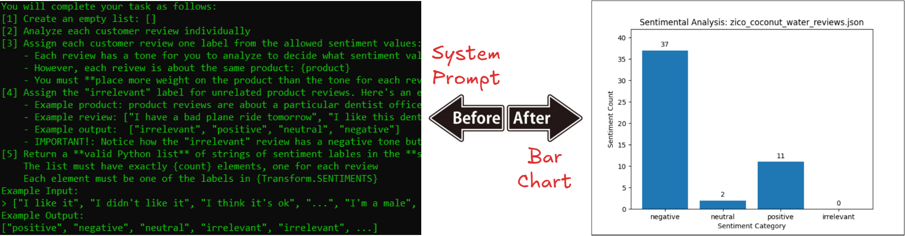
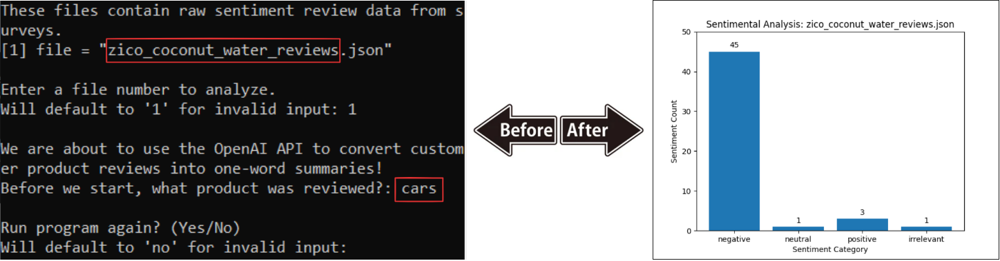

# Sentimental Analysis with OpenAI [🏡](https://github.com/barronbytes/mini-projects/tree/main)

This project allows business clients to **automate sentimental analysis of customer product reviews**. Overall, this project resembled an ETL pipeline. Static JSON data was extracted, then transformed with OpenAI for sentimental analysis, and loading involved creating a visualization with Matplotlib. At a high-level, the **ETL pipeline** did this:



* Extraction: Standardized and validated customer reviews to use
* Transformation: Used OpenAI to apply sentiment labels to reviews
* Loading: Produed bar graph of sentiment label results

## Live Demo [🔝](#sentimental-analysis-with-openai-)

Feel free to check out a better view of the [project here](https://barronbytes.github.io/OpenAI/)!



## Features [🔝](#sentimental-analysis-with-openai-)

* **Backend Tools:** Python, JSON, Unittest
* **Data Science Tools:** OpenAI, Matplotlib

## Prerequisites [🔝](#sentimental-analysis-with-openai-)

Before running this project locally, ensure you have the following installed:

* IDE (VS Code, PyCharm, etc.)
* Install Python 3.10+ version > for type hinting compatability > visit [python download page](https://www.python.org/downloads/)
* Install OpenAI: `pip install openai` > see [API Key Setup](#api-key-setup)
* Install Matplotlib: `pip install matplotlib`
* Bourne Shell compatible OS like Linux or macOS > to run test runner script that executes all unit tests in project > Windows users should [download WSL2](https://learn.microsoft.com/en-us/windows/wsl/install)

## Quick Start [🔝](#sentimental-analysis-with-openai-)

Follow the steps below to correctly setup the project on your local device.

### API Key Setup [🔝](#sentimental-analysis-with-openai-)

The purpose of these steps is to prevent publicly exposing your API on the internet.

1. Visit OpenAI page to [create API key](https://platform.openai.com/docs/libraries)
2. Terminal (safely save API Key): `echo 'export API_OPENAI="your_api_key_here"' >> ~/.bashrc && source ~/.bashrc`
3. Python file (imports): `import os`
4. Python file (access API Key): `api_key = os.getenv("API_OPENAI")`

### Backend Setup [🔝](#sentimental-analysis-with-openai-)

1. **Clone** the repository
2. **Delete** the demo folder
3. **Delete** the .vscode folder *(will be re-created in step 4)*
4. **Edit JSON settings:** program files and test files are in different folders; this step helps VS Code autocomplete and resolve imports correctly, reducing any underlining errors caused by missing paths in workspace

> Windows/Linux Users:
> Open the **Command Pallete** (Ctrl+Shift+P) > search for **Preferences: Open Settings (JSON)** > paste and save code shown below

> macOS Users:
> Open the **Command Pallete** (Cmd+Shift+P) > search for **Preferences: Open Settings (JSON)** > paste and save code shown below

```json
{
    "python.autoComplete.extraPaths": [
        "./src"
    ]
}
```

## Usage [🔝](#sentimental-analysis-with-openai-)

### Running Program

You can run the program in either of two ways:
* Ensure terminal is at `src folder` > run program from GUI or terminal with `python3 main.py` command
* Ensure terminal is at base folder > run program from terminal with `bash main.sh` command

You will notice this control flow each time the program runs: enter file for analysis > enter product > repeat program option. The `assets folder` will be updated each time to either create or overwrite a visualization image. The program also prints out error messagse if file data is not found or reviews contain empty or invalid items.

### Running Test Files

The project had a total of 5 unit tests pass with the `unittest` module across 2 source files. These test files are each individually located inside the `test folder`. However, you can only run them from the base folder as follows:
* Ensure terminal is at base folder > run `test.sh` file from GUI or terminal with `bash test.sh` command

### Uploading New Data

You can add new data for analysis inside the `data folder`. The folder has three JSON files by default. Two contain data for reviews. One for a fictitional Zico Coconut Water supplier and another for the NBA. Use the third file, `template_reviews.json`, as a template whenever you want to add new reviews for analysis. Just make sure you use the same JSON structure. You will need to **modify two keys with falsy placeholders**. The product key and results key each have default values of "" and [], respectively, and these values should be replaced with a product type string and a list of product review strings.

## Development Roadmap [🔝](#sentimental-analysis-with-openai-)

This project was completed in four days with the following project folder structure:



**I referred to these resources to guide my project completion:**

* JSON: [Past file handling mini-project](https://github.com/barronbytes/Learning-to-Code/tree/main/File-Handling) on working with JSON data.
* Data Validation: [Past heart rate monitoring data processing mini-project](https://github.com/barronbytes/Learning-to-Code/tree/main/Data-Science/Summary-Statistics) completed to handle **data extraction**. Specifically, the `get_file_data.py` file within the source code folder.
* OpenAI API: [Official OpenAI API documentation for the Response API model](https://platform.openai.com/docs/guides/responses-vs-chat-completions) helped me [generate prompts](https://platform.openai.com/docs/guides/prompt-generation) for **data transformation**. Alternatively, the Reponse API model is a different way to interact with OpenAI that was not chosen.
* Matplotlib: [Official documentation on bar charts](https://matplotlib.org/stable/gallery/lines_bars_and_markers/bar_label_demo.html) helped me create and **load a visualization**.

### Setbacks [🔝](#sentimental-analysis-with-openai-)

This was my first time using the OpenAI API on a project. I faced two major issues midway through development related to this tool. First, my input data and output data lengths were consistently different. Second, my final visualization results were untrustworthy. To expand on this, my program allowed users to input the product for reviews.

I fixed the first problem by **writing better prompts and realizing the AI gives back a string by default**. I improved my prompts with clearer descriptions of inputs, steps to follow, and expected output. The image below shows how the model responded before I updated the system context. The first four lines were manually added by me for your reading, and were not part of the AI response results. As you can see, the model accepted 50 input reviews but returned 46 output sentiment labels. It skipped 10 real reviews and created 6 hallucination reviews. Also remember, the final result is a Python string and not a list. Learning this helped me complete the extraction step of my ETL pipeline.



Unfortunately, I was unable to resolve the second problem. My program allows users to input the product for the customer reviews. This provides the opportunity to create a mismatch between product and reviews. However, for these cases the model did not correctly apply the "irrelevant" label to reviews in the final bar chart created as expected. Read more about this here: [Analysis section > Question 2](#analysis).

### Successes [🔝](#sentimental-analysis-with-openai-)

Getting past the OpenAI blocker was a big win. My full system and user context prompts are in the `etl_transform.py` file. The image in the [results section shows part of the system context](#results). Once I realized the AI response was just a string, I used regular expressions to extract and analyze the data—something I had experience with from building a [static site generator](https://github.com/barronbytes/Guided-Projects/tree/main/Static-Site-Generator). This project showed I could: build a basic ETL pipeline; use JSON, APIs, regular expressions, and unit tests; and create visualizations.

### Improvements [🔝](#sentimental-analysis-with-openai-)

The current project setup requires users to manually download and run it locally in an IDE, which limits the potential user base. Many users are not familiar with this process, making it difficult for a broader audience to use this project.

The next step to advance this project would be to develop a frontend component. A web app with features allowing users to upload files and perform CRUD operations would be ideal.

## Results

The program analyzed the `zico_coconut_water_reviews.json` file and returned the following:
* 50 input reviews > bar graph showing 50 labeled sentiments
* Sentimental analysis results > 37 negative, 2 neutral, 11 positive, and 0 irrelevant



## Analysis

The following questions assume the program analyzed the `zico_coconut_water_reviews.json` file:

### Question 1

> What is the **most common sentiment** observed in your sample of 50 reviews according to your OpenAI labeled data?

OpenAI sentimental analysis of 50 Zico Coconut Water reviews showed the most common sentiment was **negative**. Here are the results: 37 negative, 2 neutral, 11 positive, and 0 irrelevant. "Negative" consistently showed up as the most commmon sentiment, and "irrelevant" rarely showed up at all when the program was run multiple times.

### Question 2

> **How reliable** do you believe these labels are? Look at the respective labels OpenAI has generated for specific reviews, does it seem like the large language model accurately described the user's review? **What risk do model hallucinations introduce** into this analysis?

The sentiment labels produced by my program are unreliable due to hallucinations.
* **Reliability:** The model repeatedly gave different visualization results when provided the same input. Also, the program did not always produce output that matched the input length.
* **Hallucinations:** My program let users enter a client product for customer reviews. The results stayed mostly the same, even when the model was told the reviews were for a different or unrelated product. In the image below, the program analyzed 50 Zico Coconut Water reviews, but the user said they were about "cars." Still, the program marked 45 reviews as "negative" and only 1 as "irrelevant," even though the system context was set up to avoid this.



### Question 3

> Using the most common sentiment, **what should the Coconut Water producer do** to improve customer satisfaction? Should they continue to pursue current market/product outcomes, or does there exist an opportunity for this business to improve its product?

As stated previously, the sentiment analysis program had problems. I wouldn’t trust it to make business decisions. But if its results were reliable,I would tell the company to discontinue its product due to extremely low favorability. They likely have very few core customers. **I would recommend the company take one of two actions:** (1) rebrand and launch a new drink, or (2) stop making its own beverages and use its infrastructure to support more successful competitors as a supply chain manufacturer.

## Credits and Contributing

[The Knowledge House](https://www.theknowledgehouse.org/) provided the project requirements and raw data for this project. Contributions are welcome! Feel free to submit a pull request to improve the project or opena  issue to report any problems.