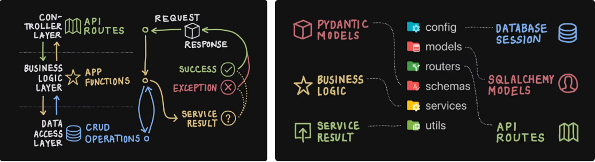

# Flashcards API [🏡](https://github.com/barronbytes/mini-projects/tree/main)

This mini-project allowed me to create a RESTful API prototype for study flashcards. It lays the groundwork for a larger capstone project aimed at enhancing math classrooms. The goal will be to allow teachers to input algorithms for questions to generate unique, randomized question-answer pairs. That way, each student is assigned different questions based upon the same algorithm, promoting academic integrity.

# Prerequisites [🔝](#flashcards-api-)

Before running this project locally, ensure you ahve the following installed:

* IDE (VS Code, PyCharm, etc.)
* Instally Python 3.10+ version > for type hinting compatability
* Install **pydantic** from terminal: `pip install pydantic`
* Install **FastAPI** from terminal: `pip install fastapi`
* Install **ASGI server** (e.g., **uvicorn**): `pip install uvicorn`

# Lessons Learned [🔝](#flashcards-api-)

The idea of completing this project seemed daunting from its conception. I had previously used openly availble APIs; however, I had never created one myself. This project allowed me to learn a lot by following these steps:

**Step 1 > Questions:** These were the initial development quetsions I faced.

1. What are popular frameworks used to create APIs?
2. What folder structure and files do I need to create an API?
3. What options exist for making an API with Python?

Ultimately, I decided to use **FastAPI** to leverage its built-in documentation support. Google Images provided me API design guidance:

Source: [Implementing FastAPI Services - Abstraction and Separation of Concerns](https://camillovisini.com/coding/abstracting-fastapi-service), by Camillo Visini

**Step 2 > Build:** I used the file structure above to start coding:

1. **Schemas:** These files define classes. In the context of an API, they are referred to as **resources** used for requests and respones. The classes were built by using the **pydantic** for data validation.
2. **Models:** No true database was used. Instead, a dictionary was used for fast indexing.
2. **Services:** These files contain **CRUD** functions. For the FastAPI built-in documentation to work, each function must return a schema file object. Only keyword arguments can be used to create object instances.
3. **Routes:** These files establish different types of **users** as routes. This API has a `teacher` and `student` user. The service file functions are reused in the route files to define both **HTTP METHODS** and **API endpoint paths**. The files show how to use **curl commands** to call each HTTP METHOD and endpoint.
4. **Main:** This is the API brain. First, the FastAPI instance is created here. Then, the routes for user types are added to the instance. 

# Credits & Additional Learning [🔝](#flashcards-api-)

These resources helped me complete this project:

* [Pydantic > Concepts User Guide](https://docs.pydantic.dev/latest/api/base_model/)
* [FastAPI > Learn > Tutorial - User Guide](https://fastapi.tiangolo.com/tutorial/)
* Medium.com > [Building REST APIs with Python and FastAPI](https://medium.com/@kapildevkhatik2/building-rest-apis-with-python-and-fastapi-f6a0c65c9af1)
* Medium.com > [A Beginner-Friendly Guide to Building a REST API with FastAPI](https://medium.com/@ttinonin/a-beginner-friendly-guide-to-building-a-rest-api-with-fastapi-fa602c16dcab)
* Medium.com > [Exploring Routers in FastAPI: Organize Your API Endpoints Like a Pro](https://medium.com/@navneetskahlon/exploring-routers-in-fastapi-organize-your-api-endpoints-like-a-pro-9f24345b7547)
* Medium.com > [Step-by-Step Guide to Creating an APIRouter in FastAPI](https://medium.com/@alfininfo/step-by-step-guide-to-creating-an-apirouter-in-fastapi-2896e5a1cced)

These resources provide deeper knowledge:

* Medium.com > [Mastering REST APIs: The Backbone of Modern Web Development](https://medium.com/@nomannayeem/mastering-rest-apis-the-backbone-of-modern-web-development-51625c10dbc7)
* Medium.com > [How to Structure Your FastAPI Projects: Part I: Blueprint](https://medium.com/@amirm.lavasani/how-to-structure-your-fastapi-projects-0219a6600a8f)
* Medium.com > [How to Setup a FastAPI Project using Conda and Poetry: Part II: Environment & Dependencies](https://medium.com/@amirm.lavasani/how-to-setup-a-fastapi-project-using-conda-and-poetry-aa98e007c7af)
* Medium.com > [How to Setup Automatic Versioning for your FastAPI App: Part III: Versioning](https://medium.com/@amirm.lavasani/how-to-add-automatic-versioning-to-your-fastapi-service-b008ed5f3edc)
* Medium.com > [How to Add i18n to Your FastAPI App: Part IV: Internalization](https://medium.com/@amirm.lavasani/how-to-add-i18n-to-your-fastapi-app-b546f7d183bb)