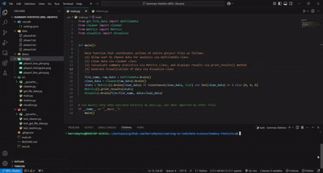
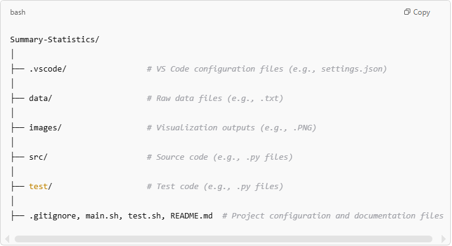
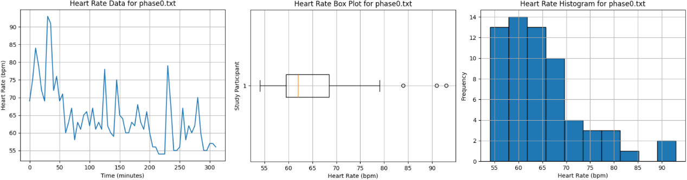
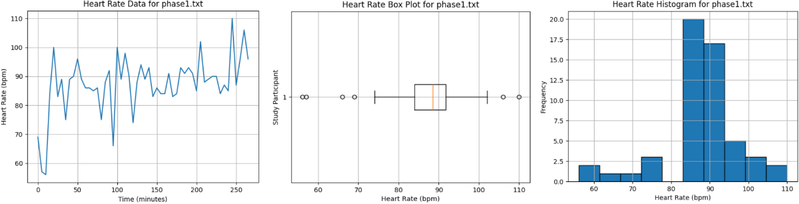
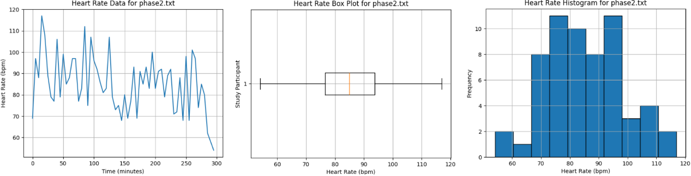
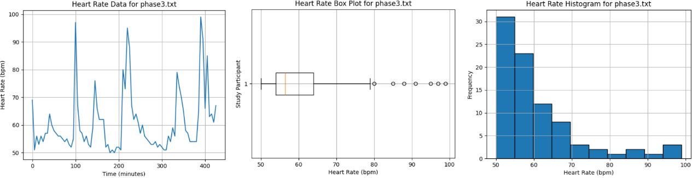

# Heart Rate Monitoring Data Processing [🏡](https://github.com/barronbytes/mini-projects/tree/main)

This project analyzes heart rate data collected in 5-minute intervals from a single study participant wearing a portable monitor. The user can select one of the provided study data files for analysis. The raw data is cleaned to remove erroneous values before calculating summary statistics. Visualizations are generated, including a line plot, box plot, and histogram.

## Live Demo [🔝](#heart-rate-monitoring-data-processing-)

Feel free to check out a better view of the [project here](https://barronbytes.github.io/hr-monitoring/)!



## Features [🔝](#heart-rate-monitoring-data-processing-)

* **Backend:** Used **JSON** for workspace configuration and **Python** for source code. Project used type hinting and the `unittest`, `os`, and `shutil` modules.
* **Data Science Tools:** Used `matplotlib` and `numpy`.

## Prerequisites [🔝](#heart-rate-monitoring-data-processing-)

Before running this project locally, ensure you have the following installed:

* IDE (VS Code, PyCharm, etc.)
* Install Python 3.10+ version *> for type hinting compatability*
* Install Matplotlib: `pip install matplotlib`
* Install NumPy: `pip install numpy`
* Bourne Shell compatible OS like Linux or macOS *> to run test runner script that executes all unit tests in project > Windows users should [download WSL2](https://learn.microsoft.com/en-us/windows/wsl/install)

## Quick Start [🔝](#heart-rate-monitoring-data-processing-)

Follow the steps below to correctly setup the project on your local device.

### Backend Setup [🔝](#heart-rate-monitoring-data-processing-)

1. **Clone** the repository
2. **Delete** the demo folder
3. **Delete** the .vscode folder *(will be re-created in step 4)*
4. **Edit JSON settings:** program files and test files are in different folders; this step helps VS Code autocomplete and resolve imports correctly, reducing any underlining errors caused by missing paths in workspace

> Windows/Linux Users:
> Open the **Command Pallete** (Ctrl+Shift+P) > search for **Preferences: Open Settings (JSON)** > paste and save code shown below

> macOS Users:
> Open the **Command Pallete** (Cmd+Shift+P) > search for **Preferences: Open Settings (JSON)** > paste and save code shown below

```json
{
    "python.autoComplete.extraPaths": [
        "./src"
    ]
}
```

## Usage [🔝](#heart-rate-monitoring-data-processing-)

### Running Program

You can run the program in either of two ways:
* main.py file inside src folder: Run program from GUI or terminal with `python3 main.py` command.
* main.sh file at root folder: Run program from terminal with `bash main.sh` command.

**Important:** You will notice that each time the program runs, the images folder is cleared and then repopulated with new files based upon the selected data file for analysis.

### Running Test Files

The project had a total of 12 unit tests pass with the `unittest` module across three source files. These tests can be run in either of two ways:
* Individually in test folder: Run test file from terminal with `bash <test_file_name>.py` command.
* Collectively in root folder: Run test.sh file from terminal with `bash test.sh` command.

### Uploading New Data

The program can handle new raw data uploads! Just make sure to you upload `.txt` files that save individual heart rate measurements on separate lines.

## Development Roadmap [🔝](#heart-rate-monitoring-data-processing-)

This project was completed in three days with the following project folder structure:



### Setbacks

This was my first time using Python to create visualizations. [Matplotlib documentation provided online examples](https://matplotlib.org/stable/index.html) that helped me know how to create line plots, box plots, and histograms.

### Successes

* **File Management:** Used `get_file_data.py` and `visualize.py` files to properly locate, create, read, update, and delete directories and files for project needs.
* **Unit Testing:** 12 tests written and passed for edge cases in 3 Python files.

### Improvements

The current project setup requires users to manually download and run it locally  in an IDE, which limits the potential user base. Many users are not familiar with this process, making it difficult for a broader audience to use this project.

The next step to advance this project would be to develop a frontend component. A web app with features allowing users to upload files and make selections would be ideal. Additionally, the app could temporarily cache data to streamline the process.

## Results [🔝](#heart-rate-monitoring-data-processing-)

Summary statistics for data files:

| File Name | Maximum HR | Average HR | Standard Deviation HR |
|-----------|------------|------------|-----------------------|
| phase0.txt| 93         | 64.59      | 8.53                  |
| phase1.txt| 110        | 87.30      | 9.90                  |
| phase2.txt| 117        | 85.18      | 13.38                 |
| phase3.txt| 99         | 60.65      | 11.00                 |

### Visualizations for `phase0.txt` file:



### Visualizations for `phase1.txt` file:



### Visualizations for `phase2.txt` file:



### Visualizations for `phase3.txt` file:



## Analysis [🔝](#heart-rate-monitoring-data-processing-)

### Question 1

> Take a look at the file labeled `data/phase0.txt`. Why might we have missing values or values that state "NO DATA" in this dataset? While we are currently ignoring these values, what might be the risk of filtering these values out?

Erroneous data might be due to either problems with the portable monitoring device (e.g. lack of power) or noncompliance from the test subject (e.g. taking monitor off). The current project doesn't track how many values are filtered out from each data file analyzed. This makes it difficult to know the significance of the untracked erroneous data.

### Question 2

> During sleep, we expect maximum heart rate of a phase to be **lower** than the maximum heart rate of all other phases. Observe the visualizations and descriptive statistics that you've calculated. Using these findings, in which phase does sleep occur? Mention numerical details that back your findings.

**Phase 0** likely represents **sleep** activity. The 98 bpm maximum heart rate here was lower than all other periods.

### Question 3

> During exercise, we expect the maximum heart rate of a phase to be **higher** the maximum heart rate of all other phases. Observe the visualizations and descriptive statistics that you've calculated. Using these findings, in which phase(s) does exercise occur? Mention numerical details that back your findings.

**Phases 1 and 2** likely represent **exercise** activity. Data was recorded from a healthy male with an expected normal resting heart rate of 60-100 bpm. Only phases 1 and 2 had maximum heart rates above the normal range, reaching 110 bpm and 117 bpm, respectively.

### Question 4

> During regular periods of awake activity, we expect the average heart rate of a phase to be relatively **lower** than the average heart rate of other phases, but we also expect standard deviation to be **higher**. In which phase do we notice this trend?

**Phase 3** likely represents **awake** activity. The 60.65 bpm average heart rate here was lower than all other periods. The standard deviation of 11 bpm was also the second highest.

## Credits and Contributing [🔝](#heart-rate-monitoring-data-processing-)

[The Knowledge House](https://www.theknowledgehouse.org/) provided the project requirements and raw data for this project. Contributions are welcome! Feel free to submit a pull request to improve the project or opena  issue to report any problems.