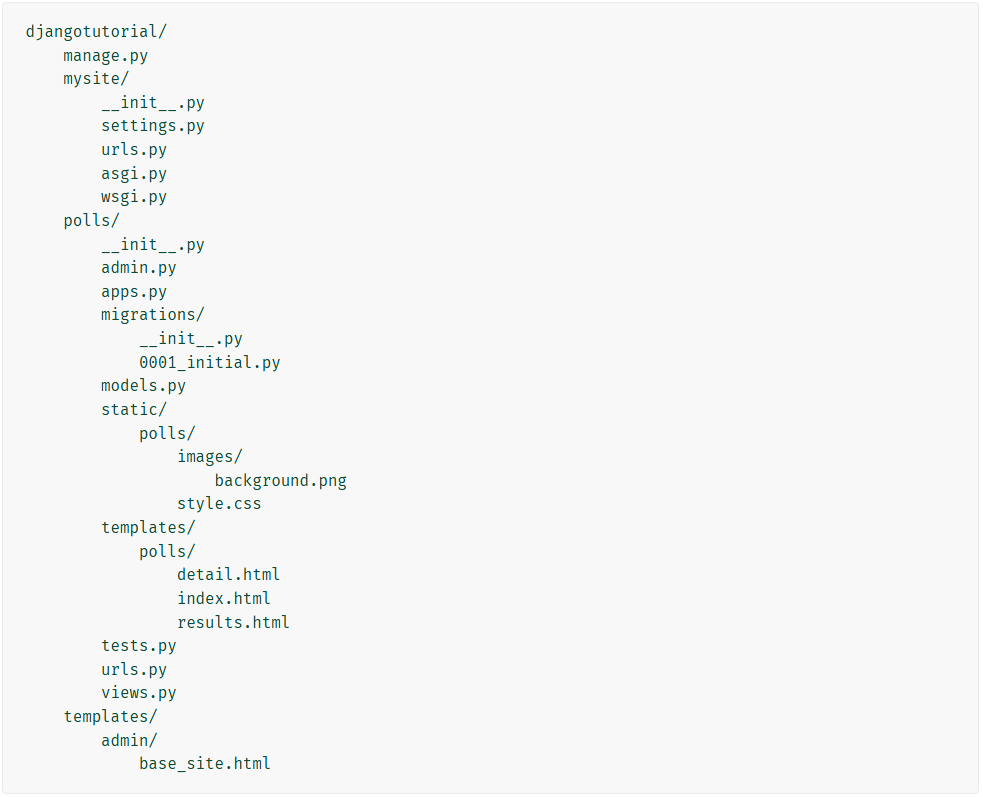

# Polling System Project [🏡](https://github.com/barronbytes/mini-projects/tree/main)

This mini-project was my first experience using Django. I followed the [official step-by-step tutorial guides](https://docs.djangoproject.com/en/5.2/) from the Django website to build a basic polling app. The goal was to learn the Django framework’s structure, modules, and default behavior.

## Prerequisites [🔝](#polling-system-project-)

Before running this project locally, ensure you have the following installed:

* IDE (VS Code, PyCharm, etc.)
* Install Python 3.10+ version > for type hinting compatability
* Install Django ([click here for instructions](https://www.djangoproject.com/))

## Lessons Learned [🔝](#polling-system-project-)

This tutorial taught me the steps to take during different phases of Django development. The highlights below outline the actions taken across six parts of this mini-project. The final project structure resembled the image below:

### Part 1: Project Setup [🔝](#polling-system-project-)

1. Go to root directory
2. Create subfolder: `mkdir <directory_name>`
3. Create project: `django-admin startproject <project_name> <directory_name>`
4. Development server: `python3 manage.py runserver`
5. Create app: `python3 manage.py startapp polls`

A basic view was then created by updating the `polls/view.py`, `polls/urls.py`, and `mysite/urls.py` files.

It's important to know that Django exposes a secret key inside `mysite/settings.py` by default. If this wasn't simply a project saved locally, then it would be important to hide this value, preferabbly as an environmental variable. 

### Part 2: Connecting Models & Databases [🔝](#polling-system-project-)

1. Database setup: `python3 manage.py migrate`
2. Creating models: update `polls/models.py`
3. Activating models: edit INSTALLED_APPS in `mysite/settings.py`, run `python3 manage.py makemigrations polls`
4. Apply models to database: `python3 manage.py migrate`
5. Console API model interaction: `python3 manage.py shell`
6. Create admin user: `python3 manage.py createsuperuser`
7. Register model on admin interface: update `polls/admin.py`
8. User admin database interface: `python3 manage.py runserver`

### Part 3: Connecting URLs, Views, and Templates [🔝](#polling-system-project-)

1. Intended urls: update `polls/urls.py` > added namespace `app_name` to URLconf
2. Update views: update `polls/views.py` > the `django.shortcuts.render()` method used to load pages > the `django.shortcuts.get_object_or_404()` method used to handle Http404 exceptions
3. HTML pages: create `polls/templates/polls` directory > created HTML pages for views with Django Template Language (DTL) > avoid hardcoding URLs

### Part 4: Forms & Generic Views [🔝](#polling-system-project-)

1. Created form: updated `detail.html` > protected against Cross Site Request Forgeries (csrf)
2. Handle redirects: updated vote() view > used `HttpResponseRedirect()` method
3. Generic views: `generic.DetailView` needs model, template name > `generic.ListView` needs model, template name, and context

### Part 5: Testing [🔝](#polling-system-project-)

Edge cases were considered in the `polls/tests.py` file using Dgango's built-in test module. Testing was limited. Diving deeper into testing might include using `LiveServerTestCase` to integrate Django with tools like **Selenium** to test in-browser HTML rendering.

### Part 6: Static Files & Admin Panel [🔝](#polling-system-project-)

1. Static files: created `polls/static` directory > saved CSS and image assets
2. Admin panel: updated `polls/admin.py` and `polls/models.py` > updated `mysite/settings.py` value for DIRS key inside TEMPLATES list > created `templates/admin/base_site.html` directory and file to overwrite admin temmplate

## Credits [🔝](#polling-system-project-)

The following resources helped me complete this project:

* [Django (Getting Started)](https://docs.djangoproject.com/en/5.2/intro/): Tutorial walkthroughs for app.
* [Django (Documentation)](https://docs.djangoproject.com/en/5.2/topics/): Django 5.2 official documentation.