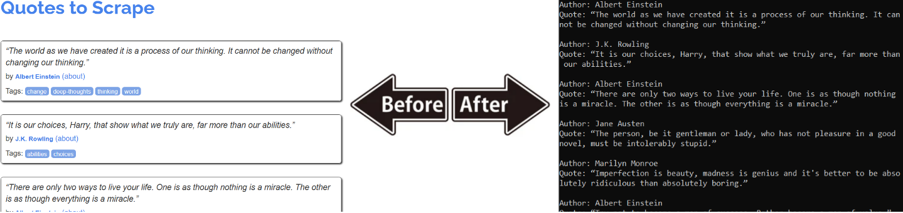
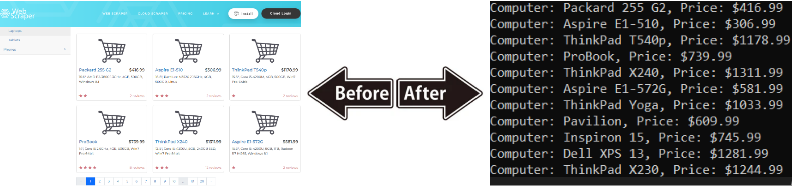

# Static Web Scraping [🏡](https://github.com/barronbytes/mini-projects/tree/main)

Web scraping refers to the process of getting select data from websites for a client. This mini-project allowed me to practice this on two static websites, where content does not change. This allows for predictable outcomes that should persist over time.

## Prerequisites [🔝](#static-web-scraping-)

Before running this project locally, ensure you have the following installed:

* IDE (VS Code, PyCharm, etc.)
* Install Python 3.10+ version > for type hinting compatability
* Install BeautifulSoup (parsing interface): `pip install beautifulsoup4`
* Install lxml (parser): `pip install lxml`

This project used **"lxml"** as a parser for educational purposes. However, this is an optional step you can skip. You can instesad use the built-in BeautifulSoup parser of **"html.parser"** if you prefer.

## Lesssons Learned [🔝](#static-web-scraping-)

**quotes.py:** Scraped data from [toscrape.com](https://toscrape.com/), a static site with [quotes for web scraping](https://quotes.toscrape.com/). Implemented two alternative approaches: one used attribute-value pair methods (e.g., `find_all`, `find`), and the other used CSS selector methods (e.g., `select`, `select_one`) to extract the same content. Running the file produced the following output:

**e_commerce.py**, **pagination.py:** Scraped data from [webscraper.io](https://webscraper.io/test-sites/), a static site with [paginated electronic e-commerce data](https://webscraper.io/test-sites/e-commerce/static/computers/laptops). The e_commerce.py file imported the `Pagination()` class from pagination.py and passed it a single URL argument. The class used a variety of helper methods to extract and transform paginated shopping data. Running the file produced the following output:

The **main takeaways** from this project were to use these **steps for static site web scraping**:

1. Create a soup object: `soup = BeautifulSoup(<your_URL>, <your_parser>)`
2. Create tag object: `tag = soup.find_all()`, `tag = soup.select()`, etc...
3. Navigating & searching parent tag tree created in step 2
4. Modifying output
5. Storing output and generating report

This process is **similar to an ETL pipeline**. Extraction, transformation, and loading take place in steps 1-3, 4, and 5, respectively.

## Credits & Continuation [🔝](#static-web-scraping-)

The following resources helped me get started:

* [Ted Boy (GitHub)](https://tedboy.github.io/bs4_doc/index.html): Unofficial documentation summary from a user.
* [Keith Galli (YouTube)](https://www.youtube.com/watch?v=GjKQ6V_ViQE&t=4230s): Introduction guide to BeautifulSoup.

The following resources provide a deeper dive into web scraping for future use:

* [BeautifulSoup (Documentation)](https://www.crummy.com/software/BeautifulSoup/bs4/doc/): Official developer documentation.
* [Keith Galli (YouTube)](https://www.youtube.com/watch?v=DcI_AZqfZVc&t=2087s): Advanced project demonstration.
